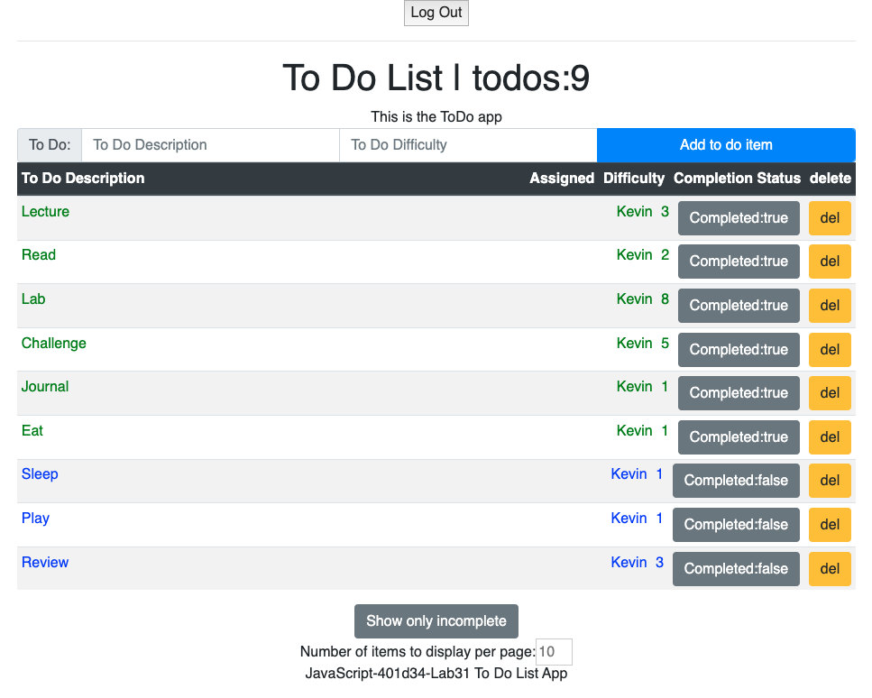

# ToDo List App
Useing React 16 with Hooks and Custom Hooks

# Screen Shot

- [x] - Have a header, main, and footer
- [x] - To Do form to enter items to do
  - [x] - form should have status and difficulty
- [x] - To Do List list items and have a complete status
  - [x] - style items to complete differently
  - [x] - toggle complete status of items
- [x] - Use the useEffect() hook to change count
  - [x] - change count in title
- [x] - Connect to running API server
  - [x] - On load display all of the to do items from db
  - [x] - When adding an item issue a POST
  - [x] - When marking todo items complete issue a PUT
  - [x] - When deleting items issue a DELETE
- [x] - Use the `useForm()` hook to manage add item form
- [x] - Create a `useFetch()` custom hook to abstract API calls
- [x] - Show maximum number of items on screen
- [x] - Display only items to be completed
- [x] - Testing
- [x] - Implement RBAC rules
  - [x] - logged in users with read can see count
  - [x] - logged in users with read can see To Do list
  - [x] - logged in users with delete can mark delete
  - [x] - logged in users with update can mark items completed
  - [x] - logged in users with create can create new items

# Setup and start

- `json-server --port 3001 --watch db.json`
- (from another terminal window) `npm run start` Go to localhost:3000
- `http get :3001/items` will return contents of db.json
- Test client with `npm run start`
- Run client with `npm run dev`

# Useful links

- [Started with CodeSandbox.io](https://codesandbox.io/s/github/astrokd/todo-react-app)
- [MDN Spread Operator](https://developer.mozilla.org/en-US/docs/Web/JavaScript/Reference/Operators/Spread_syntax)
- [StackOverflow: Fetch PUT and DELETE examples](https://stackoverflow.com/questions/40284338/javascript-fetch-delete-and-put-requests)
